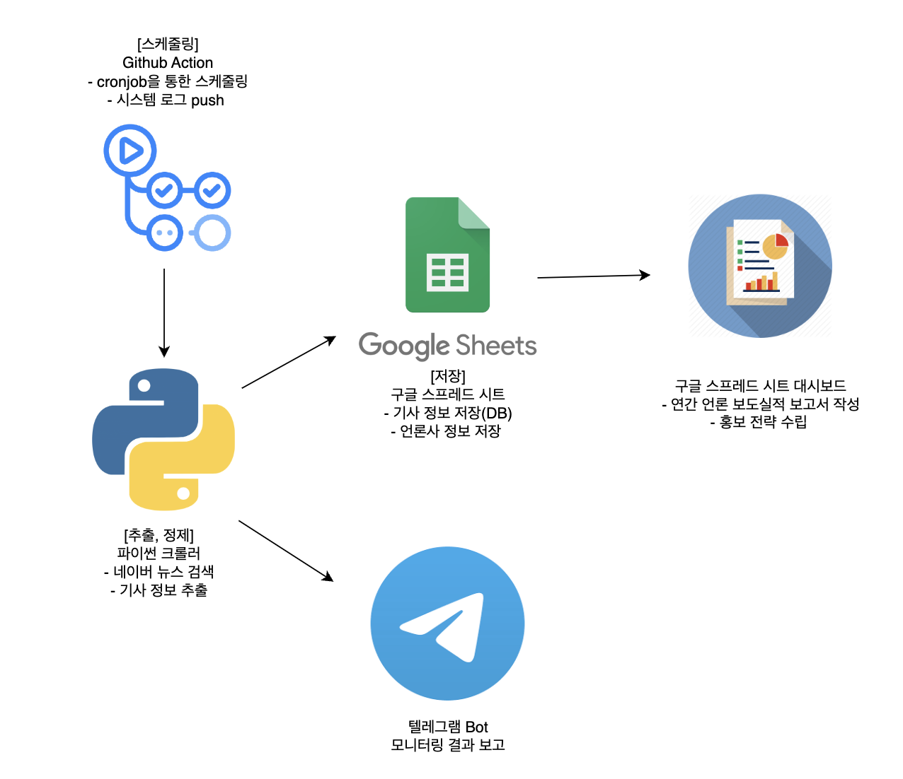
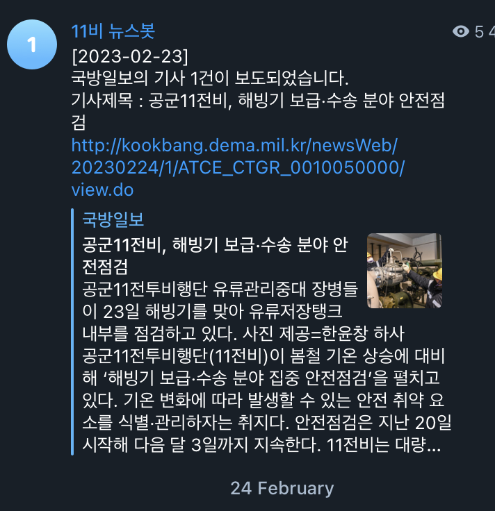
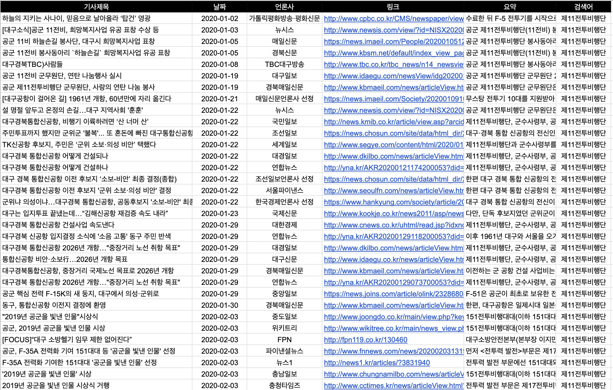

# 바라봄 프로젝트

## 바라봄 프로젝트란?
<!--Wirte one paragraph of project description -->  
공보 업무에 필요한 언론 모니터링 및 보고 업무를 효율적으로 수행하기 위해 구축한 프로젝트입니다. 뉴스 검색, 기사 정보 저장, 보고 등의 과정을 자동화할 수 있는 데이터 파이프라인을 구축했습니다.

## Overview
<!-- Write Overview about this project -->
**기능**
- 키워드 기반 뉴스 기사 자동 검색
- 검색 기사 제목, 링크, 매체 DB 저장 
- 텔레그램 알림
- [구현예정] 긍부정 뉴스 분류 -> 현재는 수동
- 시각화 대시보드 구축(구글 스프레드 시트)
- Github Action Cron 스케줄링

## 기능 예시
- 텔레그램 보고 양식

- 데이터 저장 예시

## Authors
  - [Daewonseo](https://github.com/daewonseo) - **Daewon Seo** - <sdw6908@gmail.com>

<!--
## Used or Referenced Projects
 - [referenced Project](project link) - **LICENSE** - little-bit introduce
-->